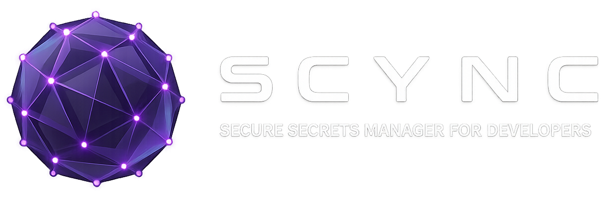

<div align="center">

<br />
<br />

# 🔐 Scync

### *Your secrets. Synced. Encrypted. Everywhere.*

**The open-source, zero-knowledge secrets manager built for developers who are tired of pasting API keys into Notion.**

[](LICENSE)
[]()
[]()
[]()
[]()

</div>

---

## The Problem

You have 47 API keys. You know where exactly zero of them are.

One lives in a `.env` file you're scared to delete. Another is in a Slack DM from 2022. A third is a screenshot buried in your camera roll. Your AWS credentials are in a Notion page titled *"stuff"* — right next to your Netflix password and a grocery list.

When you need your OpenAI key, you either find it in 3 seconds or spend 45 minutes regenerating it and updating 6 projects. There's no in-between.

This is not a workflow problem. This is a **missing tool** problem. And the existing tools don't actually solve it:

| Tool | The Issue |
|---|---|
| **Bitwarden / 1Password** | Built for website passwords, not API keys. No metadata, no rotation tracking, awkward for multi-line recovery codes. |
| **Infisical / Doppler** | Engineering team CI/CD tools. You need a screwdriver; they're handing you a factory. |
| **HashiCorp Vault** | You need a dedicated server and two weeks just to get started. |
| **Notion / Apple Notes** | Zero encryption. Notion staff can read your secrets. You know this. You still do it. |
| **KeePassXC** | Great security. No cloud sync. Your phone has no idea your vault exists. |

**There is no tool that is personal-first, zero-knowledge, cross-platform, open source, and actually pleasant to use.**

Scync is that tool.

---

## What Scync Is

> *Notion for developer secrets.* Calm. Organized. Yours. Encrypted.

Scync is an open-source, zero-knowledge, cross-platform secrets manager for individual developers. It gives you one beautiful place to store every API key, token, OAuth secret, recovery code, and credential — organized by project, searchable in milliseconds, copyable in one click, accessible on every device you own.

The server never sees your plaintext data. Your vault password never leaves your device. **Not "we promise." Architecturally impossible.**

### The Core Loop

```
Unlock vault  →  Find secret  →  Copy value
```

That's it. Everything else exists to make that loop faster and the secrets inside it more trustworthy.

---

## Features

### 🔑 Secrets, not passwords
Scync is purpose-built for what developers actually store: API keys, Personal Access Tokens, OAuth client secrets, webhook signing secrets, recovery/backup codes, SSH passphrases, database connection strings, service account credentials. Each type has its own UX.

### 📁 Project-based organization
Secrets live in projects, not a flat list. Your `Stripe` project holds all Stripe keys across environments. Your `Side Project Alpha` holds everything for that app. Organized the way you actually think about your work.

### 🧮 Recovery code UX that actually works
Recovery codes aren't just a text field. They're numbered. You mark them as used. The remaining count is always visible. When you're locked out of GitHub at 2am, you'll know exactly which code to use and whether you have any left.

### ⏰ Expiry and rotation dashboard
Secrets have lifecycles. Scync surfaces them. See what's expiring in the next 30 days. See what hasn't been rotated in over a year. A quick scan of your dashboard tells you the health of your entire credential ecosystem.

### 📄 `.env` workflow integration
Import an entire `.env` file into a project. Export a project back to a `.env` file. The gap between "local secrets" and "stored secrets" is one drag-and-drop away.

### ⚡ One-click copy, always masked
The primary action on every secret is copy. Values are masked by default. Toggle to reveal only when you need to see. Clipboard access is one click, no confirmation dialogs, no "are you sure?"

### 🌐 Web + Desktop + Mobile, same codebase
One React codebase. Three platforms. The web app, Electron desktop app (Windows), and Capacitor mobile apps (iOS + Android) are identical — same components, same logic, same encrypted sync via Firestore.

### 🔍 Instant search and filtering
Search by name or service. Filter by type, environment, status. All in-memory — no network calls, no loading spinners, just results.

---

## Security Model

This is the part that matters most. Read it.

### Zero-Knowledge Architecture

Scync has two completely independent security layers that must never be conflated:

**Layer 1 — Identity (Firebase Auth)**
- Handles Google Sign-In
- Controls which Firestore documents you can access
- *Does not protect secret content*

**Layer 2 — Encryption (Vault Password + Web Crypto API)**
- Operates 100% on your device
- Firebase never participates in this layer
- *The only thing that can decrypt your secrets*

A Firebase breach doesn't expose your secrets. A compromised Google account doesn't expose your secrets. Both must be compromised simultaneously — and an attacker still needs to brute-force a PBKDF2-derived AES-256 key.

### Encryption Specification

```
Key Derivation:   PBKDF2-SHA256, 310,000 iterations (OWASP 2023)
Encryption:       AES-256-GCM (authenticated encryption)
IV:               Fresh 12-byte random IV per encrypt operation
Key Material:     vaultPassword + uid (cross-account attack prevention)
Salt:             16-byte random, stored in Firestore (not secret by design)
Implementation:   Web Crypto API only — no third-party crypto libraries
Key Storage:      In-memory CryptoKey object (non-extractable) — never persisted
```

### What Firebase Can (and Cannot) See

| Field | Firebase Sees |
|---|---|
| Secret name | ✅ Plaintext (enables server-side search) |
| Service, type, environment | ✅ Plaintext (enables server-side filtering) |
| Timestamps | ✅ Plaintext |
| **Secret value** | ❌ Encrypted blob |
| **Notes** | ❌ Encrypted blob |

The metadata is intentionally plaintext — it enables fast filtering without decryption round-trips. The content that matters is always encrypted.

### Vault Password Verification (No Password Storage)

Scync verifies your vault password without storing it or a hash of it. On first setup, a known plaintext (`"Scync_VALID_v1"`) is encrypted with your derived key. On every subsequent unlock, Scync attempts to decrypt it. If the AES-GCM authentication tag passes, the password is correct. If it fails, it throws. No timing attacks. No stored hashes. No password recovery (by design).

### Security Policy
For more details on our zero-knowledge architecture, cryptographic specification, and vulnerability reporting process, please see [SECURITY.md](SECURITY.md).


---

## Tech Stack

| Layer | Technology | Why |
|---|---|---|
| Language | TypeScript (strict) | Type safety across all packages from day one |
| Framework | React 18 + Vite | Concurrent features, fast HMR, works in all three runtimes |
| Styling | Tailwind CSS v3 | Utility-first, design token system, tiny production bundle |
| State | Zustand | Zero boilerplate, TypeScript-native, no context providers |
| Backend | Firebase (Auth + Firestore + Hosting) | Real-time sync, Google Sign-In, free personal tier |
| Cryptography | Web Crypto API | Browser-native, NIST-standardized, zero dependencies |
| Desktop | Electron v28+ | Bundled Chromium — zero browser inconsistency |
| Mobile | Capacitor v5 | Same codebase on iOS + Android, no React Native rewrite |
| Monorepo | pnpm workspaces + Turborepo | Intelligent caching, enforced build order |
| Testing | Vitest + RTL + Playwright | Unit, component, and E2E coverage |
| CI/CD | GitHub Actions | Lint, test, preview deploy, and release pipelines |

---

## Monorepo Structure

```
Scync/
├── apps/
│   ├── web/               # Vite app → Firebase Hosting
│   ├── desktop/           # Electron wrapper → .exe installer
│   └── mobile/            # Capacitor wrapper → iOS + Android
│
├── packages/
│   ├── core/              # Crypto, Firestore ops, TypeScript types
│   ├── ui/                # Shared React components + design system
│   └── config/            # Shared ESLint, TypeScript, Tailwind config
│
├── turbo.json             # Build pipeline: core → ui → apps
└── pnpm-workspace.yaml
```

The rule: platform-specific code lives only in `apps/`. Everything in `packages/` is pure, shared, and testable.

---

## Getting Started

### Prerequisites

- Node.js 18+
- pnpm 8+
- A Firebase project (free Spark plan works)

### Setup

```bash
# Clone the repo
git clone https://github.com/hariharen9/Scync.git
cd Scync

# Install dependencies
pnpm install

# Configure Firebase
cp apps/web/.env.example apps/web/.env.local
# Fill in your Firebase project credentials

# Start the web app in development
pnpm dev --filter web
```

### Running the desktop app

```bash
# Build the web app first
pnpm build --filter web

# Run in Electron
pnpm dev --filter desktop
```

### Running on mobile

```bash
# Build the web app
pnpm build --filter web

# Sync to native projects
npx cap sync

# Open in Xcode or Android Studio
npx cap open ios
npx cap open android
```

### Running tests

```bash
# All tests
pnpm test

# Unit tests only (crypto, data transforms)
pnpm test --filter core

# E2E tests (requires Firebase emulator)
firebase emulators:start &
pnpm test:e2e
```

---

## Roadmap

### MVP — The Foundation
- Google Sign-In + vault password (two-layer auth)
- AES-256-GCM client-side encryption
- Full CRUD on secrets with rich metadata
- Project-based organization
- Search and filter (in-memory, instant)
- Copy-to-clipboard without reveal
- Web app (Firebase Hosting)
- Responsive layout (works on mobile browsers)

### V2 — Native Platforms
- Electron desktop app (Windows installer)
- Capacitor mobile apps (iOS + Android)
- Biometric unlock (Face ID / fingerprint)
- Recovery code UX (numbered, mark-as-used)
- Expiry and rotation dashboard
- `.env` import and export

### V3 — Power Features
- Browser extension (developer-focused, not autofill)
- Automatic key rotation (GitHub, AWS, etc.)
- Self-hosted backend option (replace Firebase)
- Tauri desktop app (smaller binary)

---

## Principles

**Zero-knowledge by default.** The server never receives plaintext. Ever. If this principle is violated once, the entire value proposition fails.

**Vault password independence.** The vault password is cryptographically separate from your Google account. Neither alone can decrypt your secrets.

**One codebase, three platforms.** No React Native. No separate mobile logic. One set of components that runs everywhere.

**Speed is a feature.** The vault loads instantly. Search is synchronous. Copy takes one click. Performance is product, not infrastructure.

**Opinionated simplicity.** No custom fields in MVP. No plugin system. No config panels. The structure is baked in — because the structure is correct for developer secrets.

**Open and auditable.** The crypto code uses only the Web Crypto API. Any developer should be able to read and verify it in under 15 minutes.

---

## Contributing

Scync is MIT licensed and open to contributions. Before opening a PR, check your feature against the decision filter:

1. Does it help a solo developer **store, find, or copy a secret faster**?
2. Does it require the server to see plaintext data?
3. Would it make the core loop — unlock → find → copy — slower or more cluttered?
4. Is it already solved well by Bitwarden, Doppler, or Infisical?

If it passes the filter, we want it. Open an issue first for anything significant.

See [CONTRIBUTING.md](CONTRIBUTING.md) for full development setup and workflow guidelines.

```bash
# Run the full CI check locally before pushing
pnpm lint && pnpm typecheck && pnpm test && pnpm build
```

---

## What Scync Is Not

To be explicit about scope (and to prevent well-intentioned PRs that miss the point):

- ❌ Not a password manager — no browser autofill, no username/URL triplets as the primary model
- ❌ Not a team tool — no sharing, no RBAC, no audit logs, no SSO
- ❌ Not a CI/CD injector — Doppler owns that space; Scync doesn't compete
- ❌ Not a secrets rotation engine — it tracks rotation dates, it doesn't call APIs to rotate keys
- ❌ Not a browser extension — no form injection in MVP or V2
- ❌ Not a subscription product — free, open source, MIT licensed, forever

---

## License

MIT — see [LICENSE](./LICENSE) for details.

Scync is and will remain free. There is no paid tier. There is no enterprise plan. There is no "features behind a paywall someday." The spec says so, and the spec is the law.

---

<div align="center">

**Scync** — Build it like you use it. Because you do.

*The tool that should have existed the moment you first pasted an API key into a Notion page.*

</div>