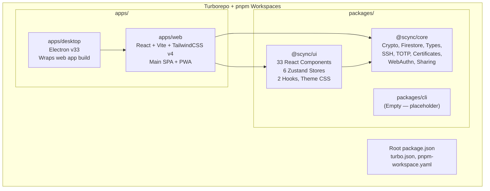
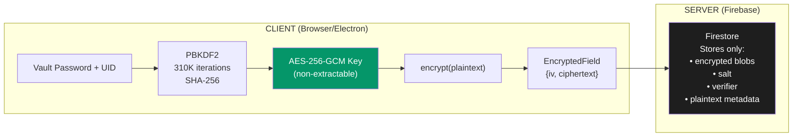
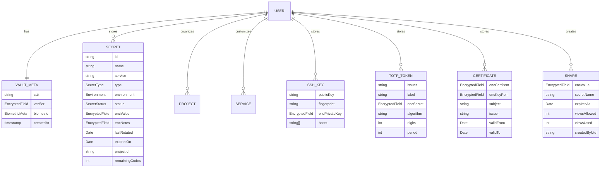
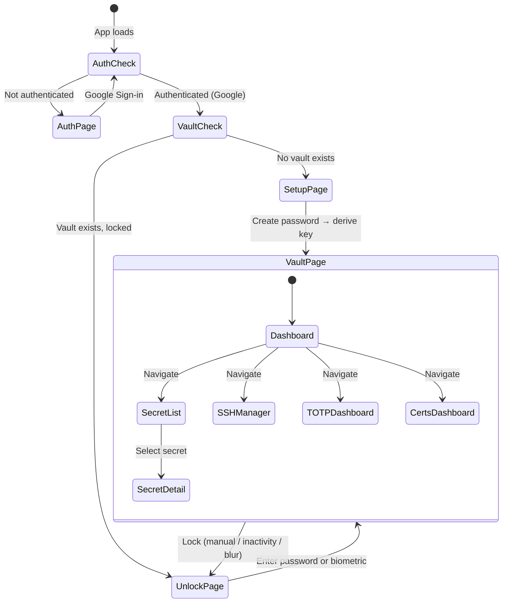

# Scync — Complete Architecture & Codebase Analysis

## Executive Summary

**Scync** is an open-source, **zero-knowledge secrets manager** targeting individual developers. It stores API keys, tokens, SSH keys, TOTP codes, SSL certificates, and recovery codes — all encrypted client-side with AES-256-GCM before anything touches the server. The project is production-deployed at [scync.space](https://scync.space) on Netlify, with a desktop Electron build distributed via GitHub Releases.

---

## 1. Monorepo Architecture



| Layer | Technology | Purpose |
|---|---|---|
| **Language** | TypeScript (strict mode, ES2022 target) | Type-safe across the entire codebase |
| **Framework** | React 18 + Vite 8 | SPA with HMR |
| **Styling** | TailwindCSS v4 + CSS Custom Properties | `@theme` tokens + `.dark` class toggling |
| **State** | Zustand | 6 flat stores, no middleware |
| **Backend** | Firebase Auth (Google) + Firestore | Auth + encrypted blob storage |
| **Crypto** | Web Crypto API (AES-256-GCM, PBKDF2) | All client-side |
| **Desktop** | Electron v33+ (electron-builder) | Wraps pre-built web output |
| **Mobile** | PWA (vite-plugin-pwa) | Installable, auto-updating SW |
| **Build** | Turborepo + pnpm 9 | Task pipeline: `^build` dependencies |
| **CI/CD** | GitHub Actions | PR checks + tag-triggered desktop releases |
| **Deployment** | Netlify | Web hosting with SPA fallbacks |

---

## 2. Security Architecture (Zero-Knowledge)

This is the architectural backbone of the project.



### Key Derivation Flow
1. Input: `password + uid` → PBKDF2 key material
2. Random 16-byte salt (stored in Firestore `/users/{uid}/meta/vault`)
3. 310,000 iterations of SHA-256
4. Output: AES-256-GCM 256-bit key (non-extractable `CryptoKey`)

### Vault Verification
- A **verifier** is created by encrypting the string `"Scync_VALID_v1"` with the derived key
- On unlock, the verifier is decrypted; if it matches, the password is correct
- **No password hash is ever stored** — verification is by successful decryption

### What's Encrypted vs. Plaintext

| Encrypted (client-side) | Plaintext (stored in Firestore) |
|---|---|
| Secret values (`encValue`) | Secret name, service, type, environment, status |
| Secret notes (`encNotes`) | Project associations, expiry dates, rotation dates |
| SSH private keys (`encPrivateKey`) | SSH public keys, fingerprints, hosts |
| TOTP secrets (`encSecret`) | Issuer, label, algorithm, digits, period |
| Certificate PEMs (`encCertPem`, `encKeyPem`) | Subject, issuer, validity dates, fingerprint |

### Biometric Unlock (WebAuthn PRF)
- Hardware-backed PRF extension generates a deterministic symmetric key
- This key encrypts (wraps) the vault password → stored as `encMasterPassword`
- On biometric auth, the hardware re-derives the same key → decrypts the password → password used normally
- Password change **invalidates** biometric enrollment automatically

### Zero-Knowledge Secret Sharing
- A **fresh AES-256-GCM key** (independent of vault key) encrypts the shared value
- The key is placed in the **URL fragment** (`#key`), which never reaches the server
- Firestore stores only the encrypted blob + lifecycle metadata (expiry, view limits)
- View count incremented atomically; Firestore rules enforce read/write constraints

---

## 3. Data Model (Firestore)



### Firestore Path Structure
```
/users/{uid}/meta/vault          → VaultMeta
/users/{uid}/secrets/{secretId}  → StoredSecret
/users/{uid}/projects/{projId}   → Project
/users/{uid}/services/{svcId}    → CustomService
/users/{uid}/ssh_keys/{keyId}    → StoredSSHKey
/users/{uid}/totp_tokens/{tokId} → StoredTOTP
/users/{uid}/certificates/{cId}  → StoredCertificate
/shares/{shareId}                → ShareDocument (cross-user)
```

### Firestore Rules
- All `/users/{uid}/**` paths: read/write if `request.auth != null` (permissive within user scope)
- `/shares/{shareId}`: Granular rules — create requires auth + matching UID; read requires not expired and not fully consumed; update only allows incrementing `viewsUsed` by 1; delete only by creator

---

## 4. Package Breakdown

### `@scync/core` — The Engine
Platform-agnostic TypeScript library. No React dependency.

| File | Purpose |
|---|---|
| [types.ts](file:///d:/Programming/Scync/packages/core/src/types.ts) | All domain types: `StoredSecret`, `DecryptedSecret`, `VaultMeta`, `StoredSSHKey`, `StoredTOTP`, `StoredCertificate`, `ShareDocument`, etc. |
| [crypto.ts](file:///d:/Programming/Scync/packages/core/src/crypto.ts) | Web Crypto API: `deriveKey`, `encrypt`, `decrypt`, `createVerifier`, `checkVerifier`, share key generation |
| [firestore.ts](file:///d:/Programming/Scync/packages/core/src/firestore.ts) | Full Firestore CRUD + real-time subscriptions for all entity types, vault password change (batch re-encryption), sharing lifecycle |
| [firebase.ts](file:///d:/Programming/Scync/packages/core/src/firebase.ts) | Firebase initialization with emulator support |
| [webauthn.ts](file:///d:/Programming/Scync/packages/core/src/webauthn.ts) | WebAuthn PRF-based biometric registration + unlock |
| [ssh.ts](file:///d:/Programming/Scync/packages/core/src/ssh.ts) | Browser-side RSA-4096 and Ed25519 key generation |
| [totp.ts](file:///d:/Programming/Scync/packages/core/src/totp.ts) | TOTP code generation, URI parsing, Base32 validation |
| [certificates.ts](file:///d:/Programming/Scync/packages/core/src/certificates.ts) | X.509 PEM parsing, cert/key pair validation |
| [constants.ts](file:///d:/Programming/Scync/packages/core/src/constants.ts) | Static lists (services, types, environments, statuses) + color mappings |
| [utils.ts](file:///d:/Programming/Scync/packages/core/src/utils.ts) | `getAttentionSecrets()` — dashboard health metrics |

### `@scync/ui` — The Shell
React component library + state management. Depends on `@scync/core`.

**6 Zustand Stores:**

| Store | Responsibility |
|---|---|
| [vaultStore](file:///d:/Programming/Scync/packages/ui/src/stores/vaultStore.ts) | Derived key, lock/unlock, CRUD for secrets/SSH/TOTP/certs, biometrics |
| [authStore](file:///d:/Programming/Scync/packages/ui/src/stores/authStore.ts) | Firebase Auth user, sign-in (Google popup), sign-out, account deletion |
| [uiStore](file:///d:/Programming/Scync/packages/ui/src/stores/uiStore.ts) | Navigation, modal state, filters/sorting, settings (persisted to localStorage) |
| [projectStore](file:///d:/Programming/Scync/packages/ui/src/stores/projectStore.ts) | Projects CRUD + subscriptions |
| [serviceStore](file:///d:/Programming/Scync/packages/ui/src/stores/serviceStore.ts) | Custom services CRUD + subscriptions |
| [shareStore](file:///d:/Programming/Scync/packages/ui/src/stores/shareStore.ts) | Share creation, revocation, consumption |

**33 React Components** — key highlights:

| Component | Role |
|---|---|
| `AuthGuard` / `VaultGuard` | Auth and vault state guards with fallback rendering |
| `Dashboard` | Health dashboard (expiring, rotation overdue, low recovery codes) |
| `SecretList` / `SecretCard` / `SecretDetail` | Secret browsing, cards, detail panel |
| `SecretForm` / `AddEditModal` | Create/edit secrets |
| `Sidebar` | Navigation: Dashboard, All Secrets, Projects, SSH, TOTP, Certs |
| `CommandBar` | `Cmd+K` quick actions |
| `SSHManagerDashboard` / `SSHKeyModal` | SSH key management |
| `TOTPDashboard` / `TOTPAddModal` | 2FA authenticator |
| `CertificateDashboard` / `CertificateModal` | SSL/TLS certificate management |
| `ShareModal` / `ShareConsumePage` / `ActiveSharesModal` | Secret sharing lifecycle |
| `SettingsModal` | Theme, inactivity lock, biometrics, password change, export, account deletion |
| `EnvImportModal` | `.env` file import/export |
| `ErrorBoundary` | Global error boundary with recovery UI |

**2 Custom Hooks:**
- `useInactivityLock` — configurable auto-lock on idle or window blur
- `useClipboard` — copy + 30-second auto-clear

### `apps/web` — The Web Application
- React SPA with 4 page states: `AuthPage` → `SetupPage` → `UnlockPage` → `VaultPage`
- Special `/share/:id#key` route for consuming shared secrets (public, no auth)
- PWA via `vite-plugin-pwa` with `autoUpdate` service worker
- Theme switching via `.dark` class on `<html>` element
- Version injected at build time from git tags

### `apps/desktop` — The Electron Wrapper
- Wraps the pre-built `apps/web/dist` output
- In production: spins up a local HTTP server to serve the web app (avoids CORS/Firebase auth issues)
- In dev: connects to Vite dev server
- Custom menu, global shortcut (`Ctrl+Shift+S`), UA spoofing for Google Auth compatibility
- Minimal preload: exposes `{ platform, isDesktop }` only

---

## 5. Application Flow



---

## 6. Design System & Styling

- **Font:** Syne (sans-serif) + DM Mono (monospace)
- **Theme:** CSS custom properties defined in `theme.css` with light/dark mode
- **Aesthetic:** Brutalist-minimal — sharp edges, no border-radius, high contrast, uppercase labels, monospace accents
- **Accent color:** Green (`#059669` light / `#10b981` dark)
- **Styling approach:** Hybrid — TailwindCSS v4 utilities + inline styles for component-level control
- **Animations:** `fadeUp`, `fadeIn`, staggered entrance animations, Framer Motion for modals and panels
- **Responsive:** Mobile-first with sliding sidebar, bottom-sheet detail panel, drag-to-dismiss

---

## 7. CI/CD Pipeline

| Trigger | Workflow | Steps |
|---|---|---|
| PR → `main` | `ci.yml` | Lint → Typecheck → Build |
| Push tag `v*` | `release.yml` | Build web → Build Electron (Win + Mac) → GitHub Release |
| Netlify auto | — | `pnpm build --filter web` → deploys `apps/web/dist` |

---

## 8. Coding Practices & Patterns

| Practice | Details |
|---|---|
| **Strict TypeScript** | `strict: true`, `isolatedModules`, `bundler` module resolution |
| **Zero-build packages** | `@scync/core` and `@scync/ui` use `"main": "src/index.ts"` — consumed directly by Vite, no separate build step |
| **Barrel exports** | Both packages use `index.ts` re-exports for clean API surfaces |
| **Encrypted/Decrypted type pairs** | Every sensitive entity has `Stored*` (encrypted) and `Decrypted*` (plaintext) variants |
| **Real-time subscriptions** | All data uses Firestore `onSnapshot` listeners, not polling |
| **Atomic operations** | Password change re-encrypts ALL entities in a single `writeBatch` |
| **Non-extractable keys** | PBKDF2-derived vault keys are marked non-extractable in Web Crypto |
| **Clipboard hygiene** | Auto-clears clipboard 30 seconds after copy |
| **No router** | SPA routing is handled by component state machines (`AuthGuard` → `VaultGuard` → views), not a router library. Share pages use `window.location.pathname` parsing |
| **Inline styles dominant** | Many components use inline `style={{}}` objects rather than CSS classes |
| **Framer Motion** | Used for modals, detail panels, and mobile animations |
| **Error boundaries** | Global `ErrorBoundary` wraps the entire app; HTML fallback error display in `index.html` |

---

## 9. Notable Architecture Decisions

1. **No server-side code** — Firebase is used purely as a dumb encrypted-blob store. No Cloud Functions.
2. **Password ≠ Auth** — Google Auth handles identity; vault password handles encryption. Separate concerns.
3. **No React Router** — The app has only 1 logical route (the vault) plus the share consumption page. State guards handle transitions.
4. **Electron serves via HTTP** — Production Electron spins up a local HTTP server rather than using `file://` protocol. This elegantly solves CORS and Firebase Auth compatibility issues.
5. **Biometric invalidation on password change** — If the vault password changes, biometric metadata is wiped. This prevents key-reuse attacks.
6. **Share keys in URL fragment** — The `#key` fragment never reaches the server (HTTP spec). True zero-knowledge sharing.
7. **MVP batch limit** — Account deletion and password change use a single Firestore batch (500 op limit). Acknowledged as a scaling constraint.
8. **CLI package is empty** — Placeholder for future CLI tool.

---

I'm ready for your directions. I have a thorough understanding of:
- The monorepo structure and dependency graph
- The complete cryptographic pipeline (PBKDF2 → AES-256-GCM → Firestore)
- All 6 Zustand stores and their interactions
- The 33-component UI layer and its design system
- The Electron wrapper architecture
- The CI/CD pipeline and deployment strategy
- Firestore data model and security rules
- All coding patterns and conventions used
